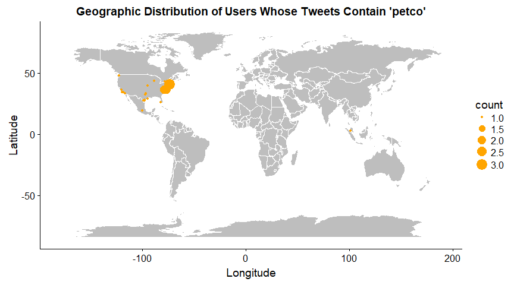
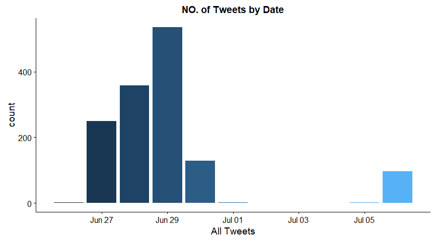
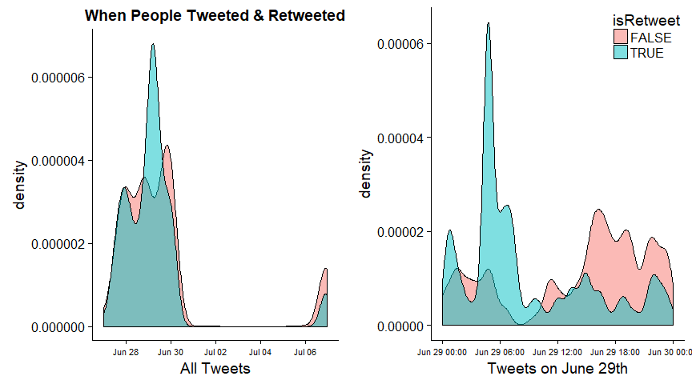
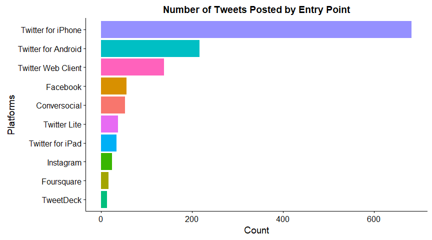
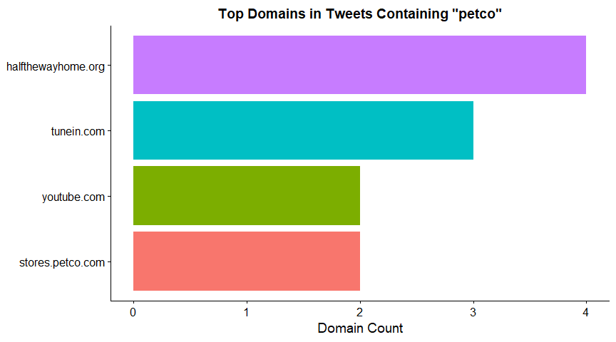
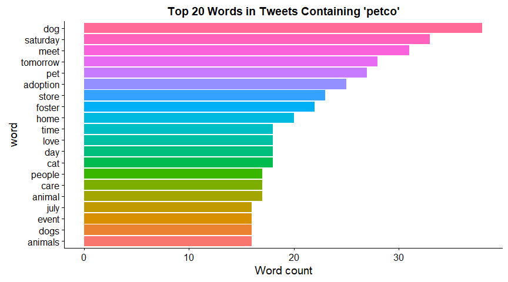
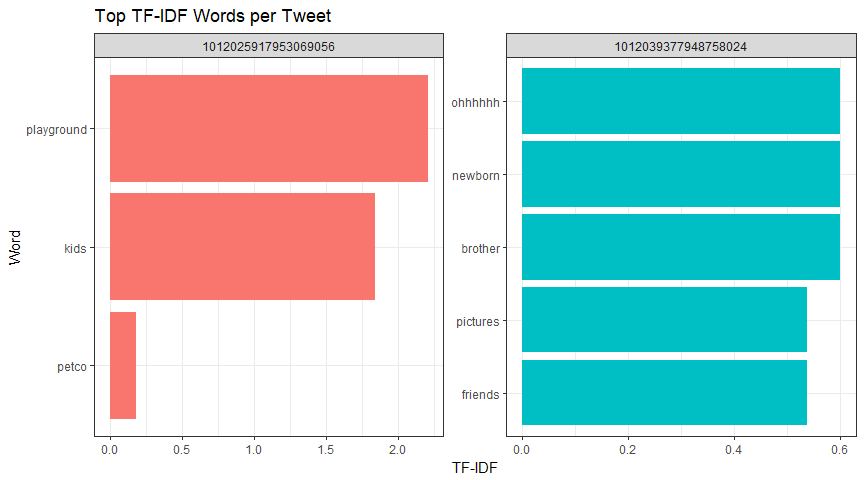
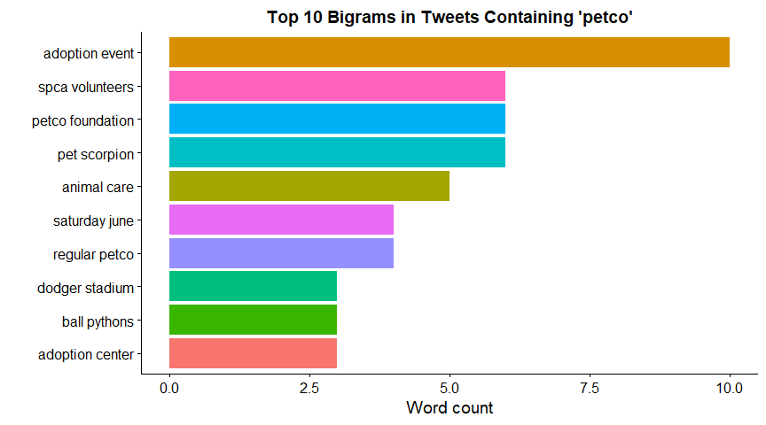
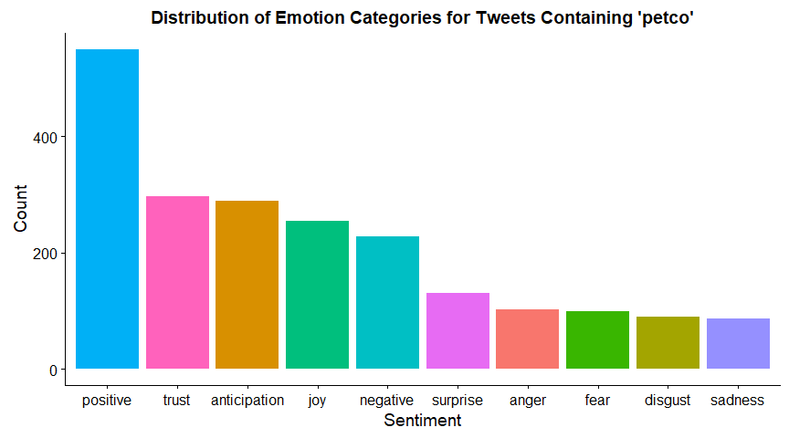
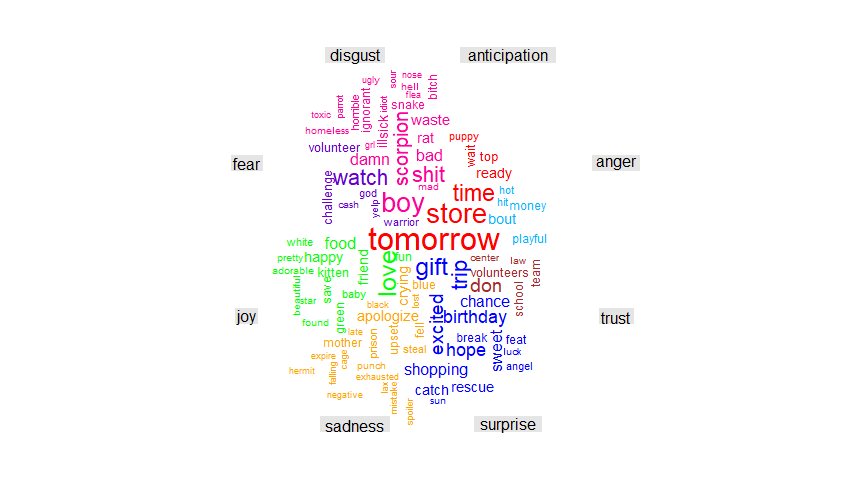

## Objectives

Twitter is an American online news and social networking service on which users post and interact with messages known as "tweets". The objectives of this study are:

• To deep dive into customer online reviews on Twitter

•	To identify the overall brand-wise sentiment on Twitter


## Set up

Packages and libraries are pre-loaded for analysis.


```r
#  Install and load packages
if (!require("pacman")) install.packages("pacman")
pacman::p_load(
  "SnowballC", # sentiment analysis
  "tm", # text mining
  "twitteR", # access to twitter
  "syuzhet", # sentiment analysis
  "httr", # working with HTTP connections
  "base64enc", #handling base64 encoding
  "tidyverse", # data cleaning and manipulation
  "tidytext", # text cleaning
  "lubridate", # get date-time info for different time zones
  "cowplot", # create coplot
  "wordcloud", # create comparison wordcloud
  "wordcloud2" # create wordcloud
)

# disable scientific notation in plots
options(scipen = 999)
```


## Data Exploration

We load data to get a glimpse of tweets. The data contains 1,372 records with 16 variables created from June 26 to July 6, 2018. 54% of them were unique posts and 46% of them were retweets. 


```r
# Load data
tweets <- readRDS(file = "data/Twitter/tweets_park_deleted.rds")

# Overview
str(tweets)
```

```
'data.frame':	1372 obs. of  16 variables:
 $ text         : chr  "Dear @Petco,\n\nThese turtles were shipped to pet stores in what appears to be tiny plastic to-go meal containe"| __truncated__ "Heads up Manhattan: ADOPTION FEES WAIVED TODAY! Help clear out the shelters at this busiest and saddest time of"| __truncated__ "We've played 5 here at Petco and we're up half a dozen.\n\n6-0, us | #LetsGoBucs https://t.co/8LlL12MlWD" "#BeALifesaver! Adopt! July 7 &amp; 8          \n\nSpring Cypress Petco at\n22511 TX-249" ...
 $ favorited    : logi  FALSE FALSE FALSE FALSE FALSE FALSE ...
 $ favoriteCount: num  93 408 147 0 0 0 0 0 1 0 ...
 $ replyToSN    : chr  NA NA NA NA ...
 $ created      : POSIXct, format: "2018-07-05 17:02:27" "2018-07-01 14:25:56" ...
 $ truncated    : logi  TRUE TRUE FALSE FALSE FALSE FALSE ...
 $ replyToSID   : chr  NA NA NA NA ...
 $ id           : chr  "1014917435533688837" "1013428494552981504" "1012906152194117637" "1015370524795555845" ...
 $ replyToUID   : chr  NA NA NA NA ...
 $ statusSource : chr  "<a href=\"https://sproutsocial.com\" rel=\"nofollow\">Sprout Social</a>" "<a href=\"http://twitter.com/download/iphone\" rel=\"nofollow\">Twitter for iPhone</a>" "<a href=\"http://twitter.com\" rel=\"nofollow\">Twitter Web Client</a>" "<a href=\"http://www.facebook.com/twitter\" rel=\"nofollow\">Facebook</a>" ...
 $ screenName   : chr  "peta2" "KeithOlbermann" "Pirates" "TXLitterControl" ...
 $ retweetCount : num  88 323 24 0 0 1 2 0 0 0 ...
 $ isRetweet    : logi  FALSE FALSE FALSE FALSE FALSE TRUE ...
 $ retweeted    : logi  FALSE FALSE FALSE FALSE FALSE FALSE ...
 $ longitude    : chr  NA NA NA NA ...
 $ latitude     : chr  NA NA NA NA ...
```

```r
#summary(tweets)
```

After checking mising values, over 97% of tweets does not have longitude and latitude information.


```r
# Check missing values
sapply(tweets, function(x) sum(is.na(x)))
```

```
         text     favorited favoriteCount     replyToSN       created 
            0             0             0          1088             0 
    truncated    replyToSID            id    replyToUID  statusSource 
            0          1114             0          1088             0 
   screenName  retweetCount     isRetweet     retweeted     longitude 
            0             0             0             0          1343 
     latitude 
         1343 
```

### Where people tweeted

For those 29 tweets with geographic information, the majority of them were posted from the east coast of the nation whereas others were from west, south coast of the States and South East Asia.


```r
geo_tweets <- tweets %>% 
  filter(is.na(longitude) == 0 & is.na(latitude) == 0) %>% 
  group_by(longitude, latitude) %>% 
  summarise(count = n())

ggplot() + 
  geom_polygon(data = map_data("world"), aes(x = long, y = lat, group = group), colour = "white", fill = "grey") +
  geom_jitter(
    data = geo_tweets, position = position_jitter(width = 0.5, height = 0.5),
    aes(x = as.numeric(longitude), y = as.numeric(latitude), size = count), color = 'orange'
  ) +
  ggtitle("Geographic Distribution of Users Whose Tweets Contain 'petco'") +
  labs(x = "Longitude", y = "Latitude")
```

<!-- -->


### When People Tweeted

There are all the tweets containing "petco“ from June 26 to July 6, 2018. 


```r
tweets %>%
  mutate(created_date = as.Date(created)) %>%
  group_by(created_date) %>%
  summarise(count = n()) %>%
  ggplot(aes(created_date, count, fill = created_date)) +
  geom_bar(stat = "identity", show.legend = F) +
  xlab("All Tweets") +
  ggtitle("NO. of Tweets by Date")
```

<!-- -->

In terms of density, there was a peak of retweets on June 29th from 0am to 8am.


```r
# Create density plot of tweets by date
timeDist <- ggplot(tweets, aes(created)) +
  geom_density(aes(fill = isRetweet), alpha = .5) +
  scale_fill_discrete(guide = "none") +
  xlab("All Tweets") +
  ggtitle("When People Tweeted & Retweeted") +
  theme(axis.text.x = element_text(size = 8))

# Zoom into peak day where there are the most retweets
peakDay <- filter(tweets, mday(created) == 29)
timeDistDayOf <- ggplot(peakDay, aes(created)) +
  geom_density(aes(fill = isRetweet), adjust = .25, alpha = .5) +
  theme(legend.justification = c(1, 1), legend.position = c(1, 1), axis.text.x = element_text(size = 8)) +
  xlab("Tweets on June 29th")

cowplot::plot_grid(timeDist, timeDistDayOf)
```

<!-- -->


### The Hottest Retweet

This tweet was retweeted 139,609 times. 

```r
# The hottest retweet found
tweets %>%
  arrange(desc(retweetCount)) %>%
  head(1) %>%
  .$text
```

```
[1] "RT @erin_w_24: So I'm ready to be a mother so I go to petco and get Marvin and the next day I'm a grandma... https://t.co/uX9bN08LOX"
```

### Entry Point
When it comes to the entry points users came from, mostly it is what we would expect: a significant amount of users posted tweets using Twitter App for iPhone, followed by Android and web client.


```r
# identify key pattern for root domain
tweets$source <- substr(
  tweets$statusSource,
  regexpr(">", tweets$statusSource) + 1,
  regexpr("</a>", tweets$statusSource) - 1
)

# plot
tweets %>%
  group_by(source) %>%
  summarise(count = n()) %>%
  arrange(desc(count)) %>%
  head(10) %>%
  ggplot(aes(reorder(source, count), count, fill = source)) +
  geom_bar(stat = "identity", show.legend = F) +
  coord_flip() +
  labs(x = "Platforms", y = "Count", title = "Number of Tweets Posted by Entry Point")
```

<!-- -->

### Popular Domains Shared

People use Twitter to share information and most of the times they include a url in their tweets. In this part, I would like to access only the 506 unique URLs included in the tweets, then use them to figure out which domains appear the most often.


```r
reg <- "([^A-Za-z_\\d#@:/']|'(?![A-Za-z_\\d#@:/]))" # set up patterns by regular expression

urls_temp <- tweets %>%
  unnest_tokens(word, text, token = "regex", pattern = reg, to_lower = FALSE) %>%
  mutate(
    word = str_replace_all(word, "https|//t|http|&amp;|&lt;|&gt;", ""),
    word = str_replace_all(word, "co/", "https://t.co/")
  ) %>%
  select(word) %>%
  filter(grepl("https://t.co/", word, fixed = TRUE)) %>%
  count(word, sort = TRUE) %>%
  mutate(word = reorder(word, n)) # 506 unique urls

# focus on urls that appeared at least twice
minimum_occurrences <- 2

urls_common <- urls_temp %>%
  filter(n >= minimum_occurrences) %>%
  mutate(source_url = as.character(word)) %>%
  select(source_url, count = n) # 19 unique urls that appeared at least twice

# obtain target URLs and return HTTP status codes
url <- t(sapply(urls_common$source_url, GET)) %>%
  as_tibble() %>%
  select(url, status_code)

# bind results to original URLs and frequency count, then filter out those 404 status (page not found), 
# and those pointing back to Twitter (like quoted tweets)
url_list <- cbind(urls_common, unnest(url)) %>%
  as_tibble() %>%
  select(url, count, status_code) %>%
  filter(
    status_code != 404,
    url != "https://t.co/",
    !grepl("https://twitter.com/", url)
  )

# use the below function to extract domains from URLs 
## split the URL by "//" and taking everything to the right of that, then splitting it by "/" and taking everything to the left of the first slash, then dropping "www." if present
extract_domain <- function(url) {
  return(gsub("www.", "", unlist(strsplit(unlist(strsplit(as.character(url), "//"))[2], "/"))[1]))
}
```

Then we can plot the most popular domains users point to as shown below:


```r
# count the frequency of a domain's occurrence in the most frequent URL list
url_list %>%
  mutate(domain = mapply(extract_domain, url)) %>%
  group_by(domain) %>%
  summarize(domain_count = sum(count)) %>%
  arrange(desc(domain_count)) %>%
  mutate(domain = reorder(domain, domain_count)) %>%
  ggplot(aes(domain, domain_count, fill = domain)) +
  geom_bar(stat = "identity") +
  xlab(NULL) +
  ylab("Domain Count") +
  ggtitle(paste('Top Domains in Tweets Containing "petco"')) +
  theme(legend.position = "none") +
  coord_flip()
```

<!-- -->

'Half the way home', which is an animal shelter organization for adoption, ranks first as the most common domain appeared, followed by tunein, youtube and petco website.


### Tweets

Let's take a look at some tweets.


```r
# View tweets
head(tweets$text, 5)
```

```
[1] "Dear @Petco,\n\nThese turtles were shipped to pet stores in what appears to be tiny plastic to-go meal containers.\n\nP… https://t.co/VGpIkveVwc"
[2] "Heads up Manhattan: ADOPTION FEES WAIVED TODAY! Help clear out the shelters at this busiest and saddest time of the… https://t.co/j4Z6uF5mnk"    
[3] "We've played 5 here at Petco and we're up half a dozen.\n\n6-0, us | #LetsGoBucs https://t.co/8LlL12MlWD"                                        
[4] "#BeALifesaver! Adopt! July 7 &amp; 8          \n\nSpring Cypress Petco at\n22511 TX-249"                                                         
[5] "RIP 5 cent goldfish that my dad just bought from petco :("                                                                                       
```

Original text contains a lot of URLs, hashtags and other twitter handles. Thus it is essential to tidy data prior to text analysis.


## Text Cleaning

This snippet of code filters out retweets whose text begins with "RT", removes URLs and certain characters that signal something other than natural language text from the tweets, then tokenizes the tweets into words.


```r
tidy_tweets <- tweets %>%
  filter(!str_detect(text, "^RT")) %>% # remove retweets
  unnest_tokens(word, text, token = "regex", pattern = reg, to_lower = T) %>% # tokenize texts by word
  mutate(
    word = str_replace_all(word, "https|//t|http|&amp;|&lt;|&gt;", ""),
    word = str_replace_all(word, "https://t.co/[A-Za-z\\d]+https://t.co/[A-Za-z\\d]", ""),
    word = str_replace_all(word, "amp", "")
  ) %>%
  filter(
    !word %in% stop_words$word,
    word != "https",
    str_detect(word, "[a-z]")
  ) 
```

Tokenization means splitting the text by spaces, removing punctuation, converting all letters to lower-case, etc., and then applying all of the metadata for the tweet to each individual word. A tweet with 10 words is a single record in the tweets data frame, but after tokenizing will result in 10 records in the new tidy_tweets data frame, each with a different word, but identical metadata. After tokenizing, I filter out any records where the word is contained in a list of stop words(a, an, the, of, etc.) or where the "word" contains no letters (i.e., raw numbers).

## Frequent topics 

Frequent topics can be used to compare frequencies across region, market and user segments.

### Word frequency

What did people talk about when they talk about "Petco"? To find the most common words associated with "Petco" in this tweet corpus, I count occurrences of each unique word, filter out the most 50 common words and order them most to least frequent.


```r
tidy_tweets %>%
  count(word, sort = TRUE) %>%
  filter(word != 'petco') %>% 
  head(50)
```

```
# A tibble: 50 x 2
   word         n
   <chr>    <int>
 1 @petco     147
 2 dog         38
 3 saturday    33
 4 meet        31
 5 tomorrow    28
 6 pet         27
 7 adoption    25
 8 store       23
 9 foster      22
10 home        20
# ... with 40 more rows
```

```r
tidy_tweets %>%
  count(word, sort = TRUE) %>%
  filter(word != 'petco') %>% 
  head(50) %>%
  wordcloud2(.)
```

<!--html_preserve--><div id="htmlwidget-944e7ee19c2ad1a81212" style="width:864px;height:480px;" class="wordcloud2 html-widget"></div>
<script type="application/json" data-for="htmlwidget-944e7ee19c2ad1a81212">{"x":{"word":["@petco","dog","saturday","meet","tomorrow","pet","adoption","store","foster","home","cat","day","love","time","#petco","@petsmart","animal","care","people","animals","dogs","event","july","dm","visit","don","kittens","cute","fish","padres","petsmart","phone","cats","join","ll","san","ve","attention","bringing","buy","food","im","learn","stop","fuck","gift","happy","local","stadium","tx"],"freq":[147,38,33,31,28,27,25,23,22,20,18,18,18,18,17,17,17,17,17,16,16,16,16,15,15,14,14,13,13,13,13,13,12,12,12,12,12,11,11,11,11,11,11,11,10,10,10,10,10,10],"fontFamily":"Segoe UI","fontWeight":"bold","color":"random-dark","minSize":0,"weightFactor":1.22448979591837,"backgroundColor":"white","gridSize":0,"minRotation":-0.785398163397448,"maxRotation":0.785398163397448,"shuffle":true,"rotateRatio":0.4,"shape":"circle","ellipticity":0.65,"figBase64":null,"hover":null},"evals":[],"jsHooks":[]}</script><!--/html_preserve-->

All hashtags and Twitter handles! Let's see what's the most common if I **omit hashtags and handles**:


```r
tidy_tweets %>%
  count(word, sort = TRUE) %>%
  filter(
    word != 'petco',
    substr(word, 1, 1) != "#", # omit hashtags
    substr(word, 1, 1) != "@" # omit @
  ) %>%
  mutate(word = reorder(word, n)) %>%
  head(20) %>%
  ggplot(aes(word, n, fill = word)) +
  geom_bar(stat = "identity") +
  ylab("Word count") +
  ggtitle(paste("Top 20 Words in Tweets Containing 'petco'")) +
  theme(legend.position = "none") +
  coord_flip()
```

<!-- -->

### Term frequency

'TF-IDF' stands for Term Frequency, Inverse Document Frequency. It's an algorithm to score the importance of words in a document based on how frequently they appear across multiple documents, as opposed to the entire data set.

Let's randomly select two tweets as examples:


```r
tmp <- tidy_tweets %>%
  select(id, word) %>%
  count(id, word) %>%
  bind_tf_idf(word, id, n) %>%
  group_by(id) %>%
  arrange(desc(tf_idf)) %>%
  slice(1:5) %>% # %>% # get top 5 words per tweet in terms of tf-idf
  ungroup() %>%
  mutate(xOrder = n():1) %>%
  inner_join(select(tweets, text, id), by = "id")

plDF <- tmp %>%
  filter(id %in% c("1012025917953069056", "1012039377948758024")) %>% # select 2 tweet ids
  ungroup() %>%
  ggplot(aes(x = reorder(word, tf_idf), y = tf_idf, fill = id)) +
  geom_bar(stat = "identity", show.legend = FALSE) +
  facet_wrap(~ id, scales = "free", nrow = 1) +
  coord_flip() +
  labs(
    x = "Word",
    y = "TF-IDF",
    title = "Top TF-IDF Words per Tweet"
  ) +
  theme_bw()

plDF
```

<!-- -->

Are the top TF-IDF words reflecting what orginal text is about? Let's take a look at the below original tweets:


```r
unique(tmp %>%
  filter(id %in% c("1012025917953069056", "1012039377948758024"))
  %>%
  .$text)
```

```
[1] "PetCo is not a playground for your kids k?"                                                                                                  
[2] "One of my Facebook friends just posted pictures of her newborn son at Petco from when they were shopping for “his big brother”. Ohhhhhh boy."
```

They are quite matching! To conclude, words with high TF-IDF in a document will tend to be words that are rare (when compared to other documents) but not too rare. In this way they are informative about what the document is about.

### Bigram

Often times, looking for the most common bigrams (two-word phrases) is more instructive than individual words. I follow the same logic to clean text, and check the words sitting next to each other.


```r
tidy_bigrams <- tweets %>%
  filter(!str_detect(text, "^RT")) %>% # filter out retweets
  mutate(text = str_replace_all(text, "https://t.co/[A-Za-z\\d]+|http://[A-Za-z\\d]+|&amp;|&lt;|&gt;|RT|https|//t", "")) %>% # clean text before tokenization
  unnest_tokens(word, text, token = "regex", pattern = reg) %>%
  mutate(next_word = lead(word)) %>%
  filter(
    !word %in% stop_words$word, # remove stop words
    !next_word %in% stop_words$word, 
    substr(word, 1, 1) != "@",  # remove user handles to protect privacy
    substr(next_word, 1, 1) != "@", 
    substr(word, 1, 1) != "#",  # remove hashtags
    substr(next_word, 1, 1) != "#",
    str_detect(word, "[a-z]"),  # remove words containing ony numbers or symbols
    str_detect(next_word, "[a-z]")
  ) %>%                         
  filter(id == lead(id)) %>%    # ensure bigrams to cross from one tweet into the next
  unite(bigram, word, next_word, sep = " ") %>%
  select(bigram, id, created)

# set bigram as stem word format
tidy_bigrams$bigram <-ifelse(tidy_bigrams$bigram == "adoption events", "adoption event", tidy_bigrams$bigram)

# plot
tidy_bigrams %>%
  count(bigram, sort = TRUE) %>%
  arrange(desc(n)) %>%
  head(10) %>%
  ggplot(aes(reorder(as.factor(bigram), n), n, fill = bigram)) +
  geom_bar(stat = "identity") +
  xlab("") +
  ylab("Word count") +
  ggtitle(paste("Top 10 Bigrams in Tweets Containing 'petco'")) +
  theme(legend.position = "none") +
  coord_flip()
```

<!-- -->


## Sentiment Analysis

In recent years, there has been a steady increase in interest from brands, companies and researchers in Sentiment Analysis and its application to business analytics. With Sentiment Analysis from a text analytics point of view, we are essentially looking to get an understanding of the attitude of customers with respect to Petco and its polarity; whether it’s positive, negative or neutral.

Here I use NRC sentiment dictionary to calculate the presence of eight different emotions and their corresponding valence.


```r
sent_tweets <- tidy_tweets

# get sentiment score per word
sentText_nerc <- get_nrc_sentiment(sent_tweets$word)
sentText <- cbind(sent_tweets, sentText_nerc)
```

Then we can see what sorts of emotions are dominant in the tweets:


```r
# plot sentiment
sentText %>%
  summarize(
    anger = sum(anger), anticipation = sum(anticipation), disgust = sum(disgust), fear = sum(fear),
    joy = sum(joy), sadness = sum(sadness), surprise = sum(surprise), trust = sum(trust),
    negative = sum(negative), positive = sum(positive)
  ) %>%
  gather(sentiment, count) %>%
  ggplot(aes(reorder(sentiment, -count), count, fill = sentiment)) +
  geom_bar(stat = "identity", show.legend = F) +
  labs(
    title = "Distribution of Emotion Categories for Tweets Containing 'petco'",
    x = "Sentiment",
    y = "Count"
  )
```

<!-- -->

Mainly positive! This is good news for Petco.

Finally, let’s see which word contributes to which emotion:


```r
# Comparison word cloud
# head(sentText, 10)

all <- c(
  paste(sentText$word[sentText$anger > 0], collapse = " "),
  paste(sentText$word[sentText$anticipation > 0], collapse = " "),
  paste(sentText$word[sentText$disgust > 0], collapse = " "),
  paste(sentText$word[sentText$fear > 0], collapse = " "),
  paste(sentText$word[sentText$joy > 0], collapse = " "),
  paste(sentText$word[sentText$sadness > 0], collapse = " "),
  paste(sentText$word[sentText$surprise > 0], collapse = " "),
  paste(sentText$word[sentText$trust > 0], collapse = " ")
)

all <- removeWords(all, stopwords("english"))

# create corpus
corpus <- Corpus(VectorSource(all))

# create term-document matrix
tdm <- TermDocumentMatrix(corpus)

# convert as matrix
tdm <- as.matrix(tdm)
tdm1 <- tdm[nchar(rownames(tdm)) < 11, ] # exclude words over 11 characters so as to fit nicely into wordcloud
#
# add column names
colnames(tdm1) <- c("anger", "anticipation", "disgust", "fear", "joy", "sadness", "surprise", "trust")
comparison.cloud(tdm1,
  random.order = FALSE,
  colors = c("#00B2FF", "red", "#FF0099", "#6600CC", "green", "orange", "blue", "brown"),
  title.size = 1, max.words = 100, scale = c(2, 0.4), rot.per = 0.4
)
```

<!-- -->

